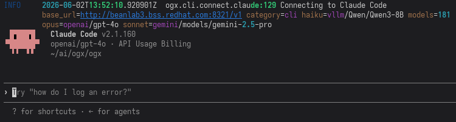
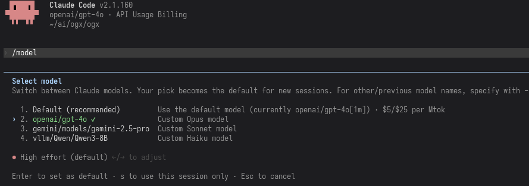

[Claude Code](https://claude.com/product/claude-code) is an AI coding tool developed and maintained by Anthropic. It has become an industry leader for AI coding assistance and allows users to create plans, manage agents, develop their own custom skills, and more.

Today we are happy to announce `ogx connect` support for Claude Code, allowing OGX users to launch Claude Code directly and access models on their OGX server. Our configuration allows the use of a single model for all tasks as well as custom mappings of up to three models for differing tasks.

Using OGX as your backend for Claude Code can provide some strong advantages over different backend options:

- Control your budget by offering a mixture of different models from different sources, rather than relying on a single backend provider
- Take advantage of Claude Code's mapping of models to seemlessly switch between self-hosted and SaaS options with no server interactions required
- Ensure redundancy by never being reliant on one SaaS backend, always keeping Claude Code running for users of your OGX server

In this blog I am going to share how to start running Claude Code using models on an OGX server, using a remote server that has both self-hosted and SaaS models enabled.

The blog assumes you already have the OGX server up and running on a remote host - see our [Getting Started guide](https://ogx-ai.github.io/docs/getting_started/quickstart) to learn more.

## Download Claude Code

Our first step here is to actually download and install Claude Code. You can see all the downloading options from [the Claude Code website](https://claude.com/product/claude-code) but generally the below `curl` command is suifficient in most cases.

```bash
curl -fsSL https://claude.ai/install.sh | bash
```

## Use Claude Code with OGX

As mentioned before, this blog assumes an OGX server is already running at `myremoteserver.com:8321` - in this case, we are also making the following assumptions:

- The `remote::vllm` provider is enabled, serving the `Qwen/Qwen3-8B` model
- The `remote::gemini` provider is enabled, with the `gemini-2.5-pro` model available
- The `remote::openai` provider is enabled, with the `gpt-4o` model available
- No authentication has been added

You can verify what models your OGX server has available with `curl http://myremoteserver.com:8321/v1/models`

Now comes the easy part - run this simple command below to start up Claude Code with your specific models:

```bash
ogx connect claude \
  --haiku-model vllm/Qwen/Qwen3-8B \
  --sonnet-model gemini/models/gemini-2.5-pro \
  --opus-model openai/gpt-4o \
  --url http://myremoteserver.com:8321/v1
```

You should be greeted by a Claude Code TUI that looks something like this:



Running `/model` should show the models you've selected as they were configured:


